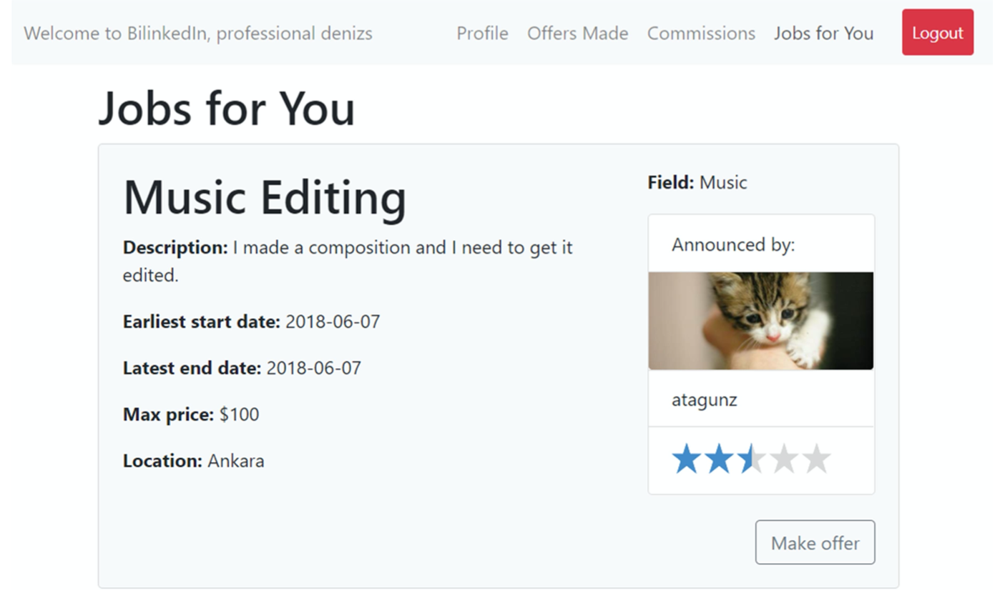

# BilinkedIn
BilinkedIn is a web platform where people in need of everyday services such as cleaning, handiwork, event organization and transportation can put up announcements and get offers from professionals providing these services. BilinkedIn is implemented as Bilkent University's [CS353 Database Systems](https://stars.bilkent.edu.tr/syllabus/view/CS/353/CS_BS/) course's term project. This repository contains only the server side.  
  
You can find project proposal and reports in `/doc` directory.

## Sample Screenshots  

 Login Screen 
  

    
  

 Jobs Screen 
  

    
  
